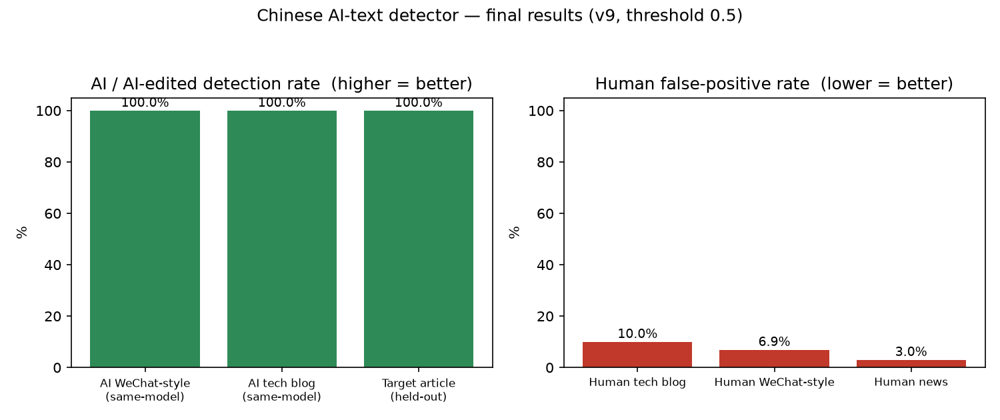

# 中文 AI 文本检测器（ai-text-detector）

判别中文文本是「人写」还是「AI 写」，并定位「AI 味」出现在哪。

- 小编码器（`hfl/chinese-roberta-wwm-ext`，可选拼接显式风格特征）二分类。
- 附一个可解释的 **AI 味报告**：分类器概率 ⋈ 话语脚手架 z 分数（对照真人基线），**逐段定位**「套话 / 报幕 / 评价收口 / 总分总」等标志。
- 覆盖域：问答 / 新闻 / 社交 / 技术博客 / **公众号**；跨生成器验证（Qwen、InternLM、GPT-4、本机前沿模型）。

> 本项目只包含**代码**。训练数据、模型权重、环境均不随仓库分发（版权 / 隐私 / 体积）。数据来源见下方「数据」。

## 主要结果（v9，二分类）

| 测试（阈值 0.5） | 结果 |
|---|---|
| 真人技术博客 误报率 | 10.0% |
| 真人公众号 误报率 | 6.9% |
| 真人新闻 误报率 | 3.0% |
| AI 公众号（同模型生成）检出率 | 100% |
| AI 技术博客（同源样本）检出率 | 100% |
| 目标博客（未进训练）P(AI) | 1.000 |

跨生成器泛化：只训练过部分生成器，即可识别未见生成器（如 Qwen 的技术博客、话语风格改写）。



> 上图由 `scripts/plot_results.py` 生成（`python scripts/plot_results.py` → `assets/results.png`）。

## 目录

```
scripts/
  style_features.py      # 表层风格特征（破折号/冒号/括号名词解释/表格/套话/排比/句长节奏…）
  logic_features.py      # 语句逻辑与语气特征（报幕/因果/对比公式/评价收口/总分总/句首连词）
  features.py            # 统一特征入口（style / style+logic）
  build_dataset*.py      # 各版本数据集构建（去重、按生成器/域切分、留出生成器与留出域）
  fetch_wiki_zh.py       # 抓中文维基长文（人类长文）
  fetch_human_blogs*.py  # 抓真人中文技术博客（人类锚点）
  fetch_human_wechat.py  # 抓真人「公众号风」文章（人类锚点）
  build_human_domain.py  # 真人新闻/社交语料
  build_gpt4_zh.py       # 从 GPT-4 中文语料抽长文（AI）
  gen_unseen.py          # 调本地/兼容 OpenAI 端点生成未见生成器语料
  gen_selfstyle.py       # 用同一模型生成/去味改写（含公众号体裁）
  train.py               # 基线分类器（HF Trainer）
  train_hybrid.py        # 编码器 + 显式特征通道（二分类，含温度校准）
  train3.py              # 三类：human / AI / AI-edited
  evaluate.py eval_gen.py eval_hybrid.py eval3.py breakdown.py
  score_text.py          # 给一整篇文章打 AI 分（滑窗）
  flavor_report.py       # ★ AI 味报告：分类器 + 话语脚手架融合 + 逐段定位
  style_compare.py style_model.py build_style_baseline.py
results/                 # 实验报告（REPORT.md 为总记录）
PLAN.md                  # 分阶段计划
```

## 快速使用

```bash
# 1) 环境（ROCm 示例；CPU 亦可）
python -m venv env && ./env/bin/pip install torch transformers datasets scikit-learn beautifulsoup4 lxml
export HF_ENDPOINT=https://hf-mirror.com   # 国内镜像

# 2) 构建数据（需先准备 data/ 下的原始语料，见「数据」）
./env/bin/python scripts/build_dataset_v9.py

# 3) 训练
HIP_VISIBLE_DEVICES=0 ./env/bin/python scripts/train_hybrid.py \
  --data_dir data/processed_v9 --out models/encoder_v9 --epochs 3 --bs 32 --max_len 512 --no_style

# 4) 出一份 AI 味报告
./env/bin/python scripts/flavor_report.py --text 文章.txt --model models/encoder_v9 --baseline tech_blog
```

## 数据来源（未随仓库分发）

- 人类：HC3-Chinese、SemEval-2024 Task 8(zh)、中文维基（`wikimedia/wikipedia`）、公开真人中文技术博客、THUCNews、知乎、以及公开转载的「公众号风」文章。
- AI：HC3/SemEval 自带生成文本；本地开源模型生成；**GPT-4 中文语料**（`FreedomIntelligence/alpaca-gpt4-chinese`、`Evol-Instruct-Chinese-GPT4`）。
- 请自行遵守各数据集的许可与相关网站的条款；本仓库代码不附带任何上述数据。

## 方法要点

1. **数据是决定性因素**：同分布易、换域/换生成器难。补「域匹配 + 同源生成器」的数据，跨生成器泛化显著提升。
2. **显式风格特征**：把「AI 味」拆成可解释特征（套话密度、排比、表格、句长方差、报幕/评价收口…），既入模型也用于报告。
3. **融合层**：分类器抓「表层 AI」，话语脚手架 z 分数抓「去味后仍残留的行文逻辑」，二者 noisy-or 融合。
4. 注意：模型对**空白归一化**敏感，推理需与训练一致的 `norm()`（脚本已处理）。

## 免责声明

AI 文风检测是**移动靶**，任何检测器都只能给出参考概率，不应作为唯一裁决依据。请勿用于对个人作品的误伤性指控。

## License

MIT（见 `LICENSE`）。
